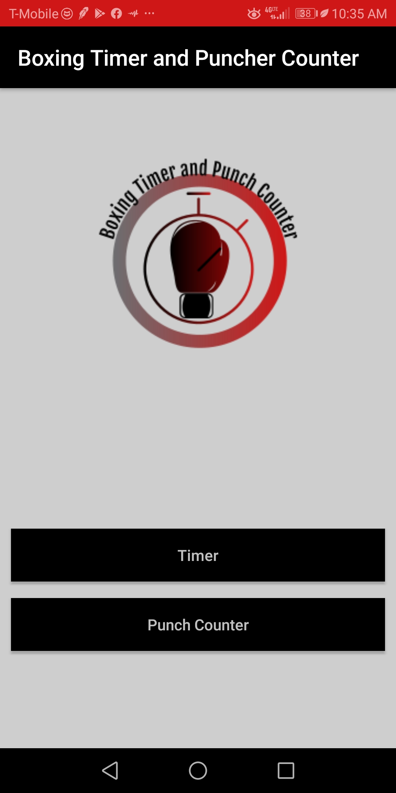
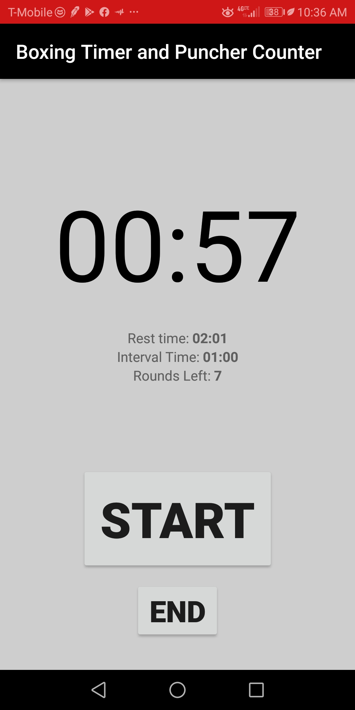
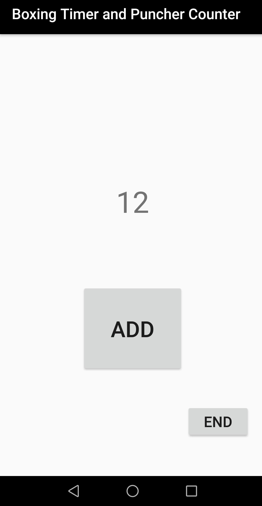

# Boxing_Timer_Punch_Counter App 
## This Repository consists of a simple Android Application featuring a Interval Timer and Punch Counter made with Android Studio  

## Two Components:  
### Boxing Interval Timer:
#### Application features an interval timer, a rest timer, and a round decrementer.

### Punch Counter:  
#### aspect features a simple button which increments a number which can be used by a trainer to know how much punches have been thrown during a shadowing boxing workout or heavy bag punch count.

## To run:  
#### download repository and run application on Android Studio. Connect Android Phone to Computer and run application as an emulator.

   
